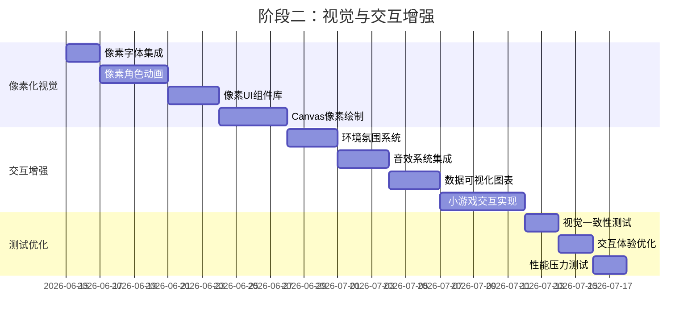
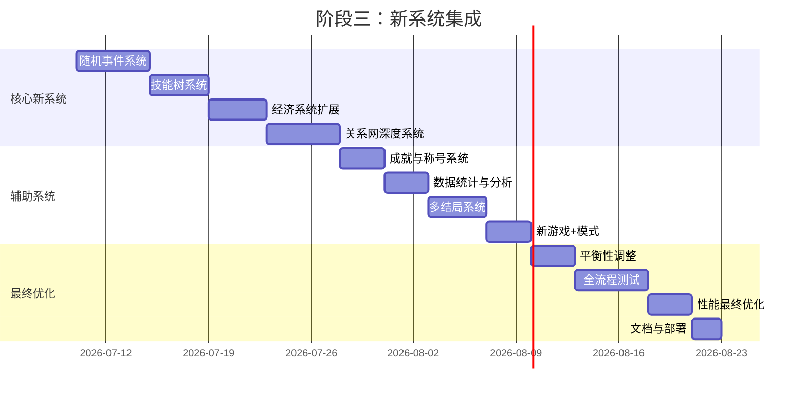

# 体制内模拟器 - 完整开发计划

## 项目概述
- 游戏类型：像素风格文字决策游戏
- 技术栈：HTML5 + CSS3 + Vanilla JS + Canvas 2D
- 部署：GitHub Pages
- 目标：解决原版游戏"纯文字枯燥、玩法单一、缺乏代入感"问题

## 三阶段开发路线

### 阶段一：核心重构（2-3周）
**目标**：建立现代化、模块化的代码基础，实现核心游戏循环

#### 已完成文件结构
```
/Users/huxufeng/Desktop/
├── index.html                          # 游戏入口
├── assets/
│   ├── css/                            # 样式表
│   ├── js/                             # 脚本
│   ├── images/                         # 图片资源
│   └── sounds/                         # 音效
```

#### 核心系统（已完成）
1. **事件总线系统** (`eventBus.js`) - 发布-订阅模式，模块解耦
2. **游戏状态管理** (`gameState.js`) - 集中管理所有游戏数据
3. **时间管理系统** (`timeSystem.js`) - 三时段（上午/下午/晚上），45分钟/槽
4. **存档系统** (`saveSystem.js`) - localStorage，自动存档+手动存档
5. **任务系统** (`taskSystem.js`) - 6种任务模板，动态生成
6. **角色系统** (`characterSystem.js`) - 5个NPC，好感度+派系
7. **经济系统** (`economySystem.js`) - 收支管理，月度结算
8. **UI系统** (`mainUI.js`, `dialogueUI.js`) - 状态栏、消息、选项
9. **游戏入口** (`game.js`) - 主循环调度

#### 阶段一验收标准
- [x] 事件总线正常工作
- [x] 时间推进系统
- [x] 任务执行与奖励
- [x] 角色好感度变化
- [x] 经济收支计算
- [x] 存档/读档功能
- [x] 移动端适配
- [x] 像素风格UI

### 阶段二：视觉与交互增强（3-4周）
**目标**：全面实现像素风格视觉系统，增强沉浸感

#### 像素化视觉
1. **像素字体集成**
   - 标题：Minecraft 字体（16px）
   - 正文：PixelOperator 字体（14px）
   - `image-rendering: pixelated;` 确保清晰

2. **角色像素动画**
   - 每个角色32×32像素
   - 4帧表情动画：中性→微笑→思考→惊讶
   - 平滑过渡：`transitionTo(emotion, duration)`
   - 角色状态指示器：头顶气泡显示当前状态

3. **Canvas像素绘制**
   ```javascript
   class PixelCanvas {
       constructor(canvasId, scale = 4) {
           this.canvas = document.getElementById(canvasId);
           this.ctx = this.canvas.getContext('2d');
           this.scale = scale;
           this.actualWidth = this.canvas.width / scale;
           this.actualHeight = this.canvas.height / scale;
           this.ctx.imageSmoothingEnabled = false;
       }
       
       drawPixel(x, y, color) {
           this.ctx.fillStyle = color;
           this.ctx.fillRect(x * this.scale, y * this.scale, this.scale, this.scale);
       }
   }
   ```

4. **环境氛围系统**
   - 时间影响：早晨/下午/夜晚不同色调
   - 天气影响：晴天/雨天/雾天不同氛围
   - 窗口外景：根据时间显示不同街景
   - 环境音效：背景白噪音、键盘声、钟表声

5. **小游戏实现**
   - 公文排版：拖拽文字块到正确位置
   - 会议安排：安排座位避免冲突
   - 调研路径：选择最优调研路线
   - 社交互动：选择对话选项影响关系

#### 音效系统
- Web Audio API 集成
- 合成音效：按钮点击、打字机、成功、警告
- 环境音：办公室背景音、键盘声、钟表声
- 角色语音：简单合成语音提示

#### 数据可视化
- Canvas 绘制能力雷达图
- 晋升路径可视化
- 关系网络图
- 经济收支图表

#### 阶段二甘特图


### 阶段三：新系统集成（4-5周）
**目标**：集成所有新设计系统，实现完整游戏体验

#### 核心新系统
1. **随机事件系统**（解决"重复度高"）
   - 事件分类：紧急/机遇/日常/个人
   - 触发机制：时间/属性/概率/关系
   - 事件链：选择影响后续发展
   - 可视化：事件卡片弹出，像素动画

2. **技能树系统**（成长路径）
   - 三线技能树：文字/社交/管理
   - 4级技能：基础→进阶→专家→大师
   - 跨线组合技能
   - Canvas 绘制技能树可视化

3. **经济系统扩展**
   - 多资源体系：金钱/人情/政治资本
   - 投资理财：储蓄/基金/股票/内部项目
   - 月度报表可视化
   - 人情往来记账

4. **关系网深度系统**
   - 多维度关系：亲密度/信任度/尊重度
   - 利益网络：共同利益/冲突/人情债
   - 派系系统：改革派/传统派/中立派
   - 关系网络可视化

#### 辅助系统
5. **成就与称号系统**
   - 多维度成就：职业/社交/文字/经济/隐藏
   - 称号系统：劳模/老油条/铁面无私等
   - 成就追踪与展示

6. **多结局系统**
   - 晋升路线：技术专家/管理干部/社交达人
   - 人生结局：体制内精英/平凡公务员/被边缘化
   - 结局收集成就

7. **新游戏+模式**
   - 继承部分能力/资源
   - 解锁隐藏内容
   - 更高难度挑战

#### 阶段三甘特图


## 技术实施细节

### 开发环境配置
```bash
# 项目初始化脚本
#!/bin/bash
# setup.sh

# 创建项目结构
mkdir -p assets/{css/modules,js/{core,systems,ui},images/{characters,ui,bg},sounds}
mkdir -p docs/{design,api,test}

# 初始化 package.json
cat > package.json << EOF
{
  "name": "bureaucracy-simulator",
  "version": "1.0.0",
  "description": "体制内模拟器 - 像素风格文字决策游戏",
  "main": "index.html",
  "scripts": {
    "dev": "live-server . --port=8080",
    "build": "node scripts/build.js",
    "test": "jest",
    "lint": "eslint assets/js/"
  },
  "devDependencies": {
    "live-server": "^1.2.2",
    "jest": "^29.0.0",
    "eslint": "^8.0.0"
  }
}
EOF
```

### 模块开发顺序
**优先级排序**：
1. **P0（必须）**：事件总线、时间系统、任务系统、存档系统
2. **P1（重要）**：UI框架、角色系统、基础经济系统
3. **P2（增强）**：像素化视觉、音效系统、小游戏交互
4. **P3（扩展）**：随机事件、技能树、关系网深度、成就系统

**依赖关系图**：
```
事件总线
   ↓
时间系统 → 任务系统
   ↓           ↓
存档系统    角色系统
   ↓           ↓
UI框架 → 经济系统
   ↓
像素化视觉
   ↓
音效系统
   ↓
小游戏交互
   ↓
随机事件
   ↓
技能树
   ↓
关系网深度
   ↓
成就系统
```

### 测试策略
| 测试类型 | 工具 | 频率 | 目标 |
|----------|------|------|------|
| 单元测试 | Jest | 每次提交 | 核心功能正确性 |
| 集成测试 | Puppeteer | 每日构建 | 模块间交互 |
| 性能测试 | Lighthouse | 每周 | 加载速度<3s，FPS>30 |
| 兼容性测试 | BrowserStack | 每阶段 | 支持Chrome/Firefox/Safari/Edge |
| 移动端测试 | 真实设备 | 每阶段 | 支持iOS/Android主流浏览器 |
| 用户体验测试 | 用户反馈 | 每阶段 | 满意度>80% |

### 部署与发布
**版本发布计划**：
- **v0.1.0-alpha**：阶段一完成，核心游戏循环
- **v0.2.0-beta**：阶段二完成，像素视觉完整
- **v0.3.0-rc**：阶段三完成，所有系统集成
- **v1.0.0**：正式发布，平衡性优化完成

**GitHub Pages 部署流程**：
```yaml
# .github/workflows/deploy.yml
name: Deploy to GitHub Pages

on:
  push:
    branches: [ main ]

jobs:
  deploy:
    runs-on: ubuntu-latest
    steps:
      - uses: actions/checkout@v3
      - name: Setup Node.js
        uses: actions/setup-node@v3
      - name: Install dependencies
        run: npm ci
      - name: Run tests
        run: npm test
      - name: Build project
        run: npm run build
      - name: Deploy to GitHub Pages
        uses: peaceiris/actions-gh-pages@v3
        with:
          github_token: ${{ secrets.GITHUB_TOKEN }}
          publish_dir: ./dist
```

## 风险与应对

### 技术风险
| 风险项 | 可能性 | 影响 | 应对措施 |
|--------|--------|------|----------|
| Canvas性能问题 | 中 | 高 | 使用离屏Canvas、限制绘制范围、实现脏矩形更新 |
| 移动端兼容性 | 高 | 中 | 渐进增强、功能降级、多设备测试 |
| 存档数据丢失 | 低 | 高 | 多重备份、数据验证、恢复机制 |
| 内存泄漏 | 中 | 中 | 严格内存管理、定期GC、内存监控 |
| 第三方字体加载 | 低 | 低 | 本地字体备份、加载失败降级 |

### 开发风险
| 风险项 | 可能性 | 影响 | 应对措施 |
|--------|--------|------|----------|
| 进度延迟 | 中 | 中 | 敏捷开发、每周评审、优先级调整 |
| 需求变更 | 高 | 中 | 模块化设计、预留扩展接口 |
| 团队协作 | 低 | 低 | 清晰文档、代码规范、定期同步 |
| 美术资源不足 | 中 | 中 | 程序生成、简化设计、分阶段实现 |

### 质量保证
**代码质量门禁**：
- ESLint通过率100%
- 单元测试覆盖率>80%
- 性能基准达标
- 无已知严重bug

**发布检查清单**：
- [ ] 所有功能测试通过
- [ ] 移动端适配完成
- [ ] 性能指标达标
- [ ] 存档兼容性验证
- [ ] 多浏览器测试通过
- [ ] 用户文档更新
- [ ] 版本号正确
- [ ] 发布说明撰写

## 总结
**总开发周期**：9-12周

**技术亮点**：
- 纯前端技术栈，无外部框架依赖
- 事件总线解耦，模块化架构
- 像素风格视觉，Canvas 2D 增强
- 完整的存档/读档系统
- 移动端优先设计
- GitHub Pages 自动部署

**预期成果**：
- 解决原版游戏"枯燥、单一、缺乏代入感"问题
- 提供丰富的游戏内容和成长路径
- 实现像素风格沉浸式体验
- 建立可扩展的游戏架构基础
